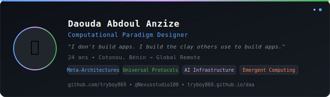

<div align="center">



<br/>


<br/><br/>

[](https://pypi.org/project/openaibox/)
[](LICENSE)
[](https://python.org)
[]()
[](https://huggingface.co/spaces/anzizdaouda0/openaibox)

**Universal LLM Introspection. Any model. Any architecture. Any provider.**

*Understand what happens inside any language model — without modifying it.*

</div>

---

## What is Open AI Box?

Open AI Box is a Python package that opens the black box of any LLM.

By tracing a live inference pass with PyTorch forward hooks, Open AI Box automatically discovers:
- The **full architecture graph** of the model
- The **injection points** — where data enters, where decisions are made, where memory lives
- The **dimension roles** — which of the hidden vector's dimensions carry causality, emotion, certainty, or temporal reasoning

Everything is exported to a single `graph.json` file.

---

## Installation

```bash
pip install openaibox
```

Requirements: `torch`, `transformers`

---

## Quickstart

```python
from openaibox import Open AI Box

# Load and analyze any HuggingFace model
gr = Open AI Box("HuggingFaceTB/SmolLM-360M")

# Step 1 — Discover the architecture
gr.discover()

# Step 2 — Map dimension roles (optional, deeper analysis)
gr.map_dimensions()

# Step 3 — Export to graph.json
gr.export("graph.json")

# Step 4 — Print summary
gr.print_summary()
```

**Output:**
```
============================================================
  GRAPHRUNTIME — Analysis Report
  Model : HuggingFaceTB/SmolLM-360M
============================================================

  Architecture : LlamaForCausalLM
  Parameters   : 361,821,120
  Layers       : 30
  Hidden dim   : 960
  Vocabulary   : 49,152

  ──────────────────────────────────────────────────────
  INJECTION POINTS
  ──────────────────────────────────────────────────────

  [INPUT]     model.embed_tokens
  Shape  : [[1, 5]] → [[1, 5, 960]]
  Detail : Token embeddings — where the prompt enters the model.

  [DECISION]  model.norm
  Shape  : [[1, 1, 960]] → [[1, 1, 960]]
  Detail : Final normalization — the model's full understanding
           before deciding which token to output.

  [OUTPUT]    lm_head
  Shape  : [[1, 1, 960]] → [[1, 1, 49152]]
  Detail : Language model head — projects to vocabulary logits.
```

---

## Core Concepts

### Injection Points

Open AI Box identifies 4 types of injection points in any model:

| Role | Description |
|------|-------------|
| `input_point` | Where the prompt enters (token embeddings) |
| `decision_point` | The richest reasoning state, just before token selection |
| `memory_point` | Where K/V projections encode context |
| `output_point` | Where logits over the vocabulary are computed |

The `decision_point` is the most significant: it holds the model's complete understanding of the context before making a decision. Its shape is always `[batch, seq, hidden_dim]`.

### Dimension Map

Each dimension of the hidden vector carries specific information. Open AI Box identifies:

- **Multi-role dimensions** — active in many categories (global regulators)
- **Specialist dimensions** — active in only one category (precise carriers)

Example output for SmolLM-360M:
```
dim_696  →  6 roles  :  syntax, causality, certainty, abstraction, time, emotion
dim_544  →  6 roles  :  syntax, causality, certainty, abstraction, time, emotion
dim_792  →  5 roles  :  syntax, causality, certainty, time, emotion

Specialist dimensions:
  causality   : [295, 157]
  certainty   : [32, 545, 702, 683]
  temporality : [164, 93, 395]
  emotion     : [691, 950, 594, 644]
```

### graph.json

The exported file contains the full analysis:

```json
{
  "openaibox": {
    "version": "1.0.0b1",
    "model": "HuggingFaceTB/SmolLM-360M"
  },
  "architecture": {
    "class": "LlamaForCausalLM",
    "total_params": 361821120,
    "hidden_dim": 960,
    "vocab_size": 49152
  },
  "injection_points": [...],
  "layer_flow": [...],
  "dimension_map": {...}
}
```

See [Understanding Results](docs/understanding_results.md) for a complete explanation of every field.

---

## Supported Architectures

Open AI Box auto-detects the injection points for:

| Family | Models |
|--------|--------|
| **Llama** | SmolLM, Llama-2/3, Mistral, Zephyr |
| **Qwen** | Qwen2, Qwen2.5, Qwen2.5-Math |
| **GPT** | GPT-2, CodeGen, StarCoder |
| **BLOOM** | BLOOM, BLOOMZ |
| **Falcon** | Falcon-7B/40B |
| **OPT** | OPT-125M → 66B |
| **MPT** | MPT-7B/30B |
| **GPT-NeoX** | Pythia, GPT-NeoX |

Any model loaded from HuggingFace `AutoModelForCausalLM` is supported.
If auto-detection fails, Open AI Box returns the full layer trace so you can identify the point manually.

---

## Advanced Usage

### Pre-loaded model

```python
from transformers import AutoTokenizer, AutoModelForCausalLM
from openaibox import Open AI Box

model     = AutoModelForCausalLM.from_pretrained("mistralai/Mistral-7B-v0.1")
tokenizer = AutoTokenizer.from_pretrained("mistralai/Mistral-7B-v0.1")

gr = Open AI Box(model=model, tokenizer=tokenizer, model_name="Mistral-7B")
gr.discover().export("mistral_graph.json")
```

### Custom contrast groups for dimension mapping

```python
from openaibox.mapping import ContrastGroup
from openaibox import Open AI Box

my_groups = [
    ContrastGroup(
        name    = "code_vs_prose",
        label_a = "code",
        label_b = "prose",
        question = "Which dimensions carry code structure?",
        prompts_a = ["def add(a, b): return a + b", "for i in range(10): print(i)"],
        prompts_b = ["She walked slowly down the street.", "The sun set over the mountains."],
    )
]

gr = Open AI Box("microsoft/phi-2")
gr.discover()
gr.map_dimensions(groups=my_groups)
gr.export("phi2_code_analysis.json")
```

### Explain a specific dimension

```python
gr.discover().map_dimensions()
print(gr.explain_dimension(696))
# {
#   "dimension": 696,
#   "roles": ["syntax_semantics", "causality", "certainty", ...],
#   "global_score": 0.91,
#   "description": "Multi-role regulator (6 categories)"
# }
```

---

## Creator

<div align="center">

</div>

---

## Documentation

- [Understanding Results (EN)](docs/understanding_results.md)
- [Comprendre les résultats (FR)](docs/understanding_results.fr.md)
- [README Français](README.fr.md)
- [Changelog](CHANGELOG.md)
- [Code of Conduct](CODE_OF_CONDUCT.md)

---

## License

MIT — see [LICENSE](LICENSE)

---

<div align="center">

</div>
